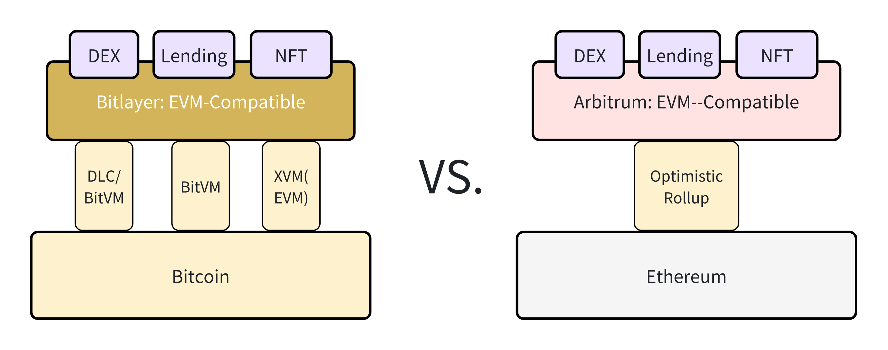
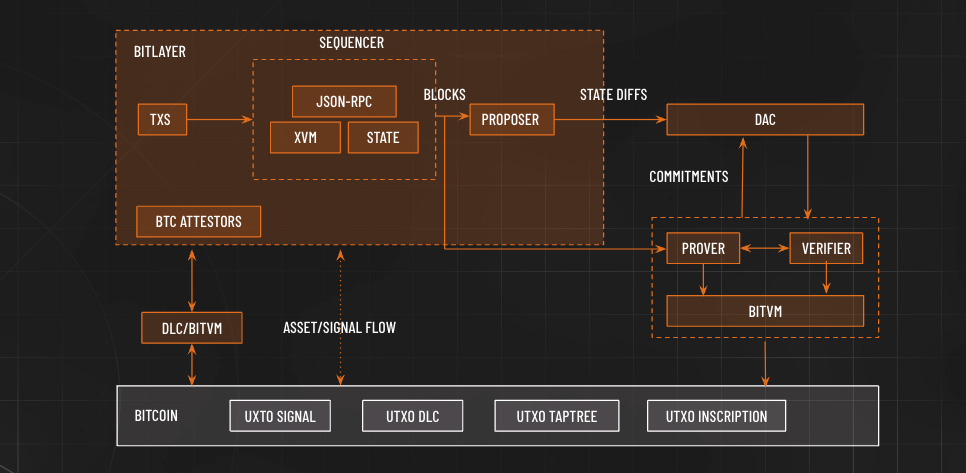
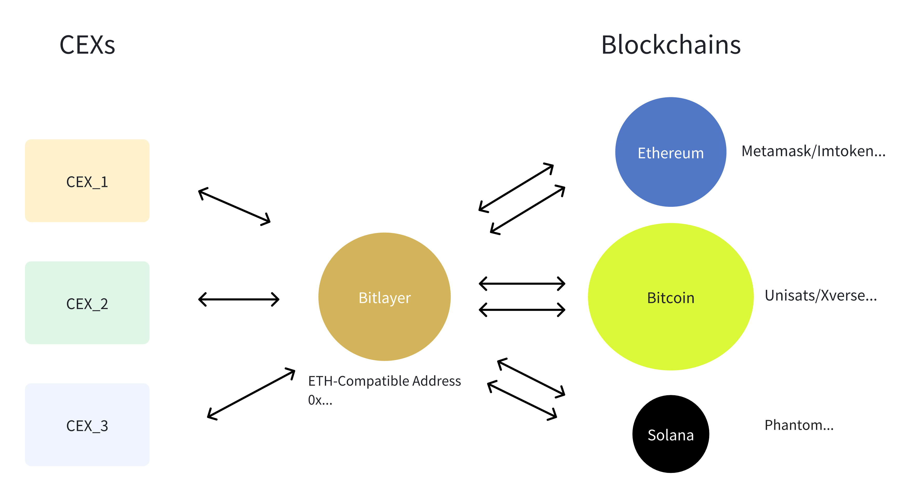

# Quick start

## Basic Concepts

For users and developers alike, the fundamental concept of Bitlayer is outlined below:

Bitlayer acts as a Layer 2 solution for Bitcoin, boasting **100% EVM and Ethereum toolchain compatibility**, with **BTC** as native token(gas token).

Users can engage with it using wallets such as **Metamask, imToken, or other Ethereum-compatible wallets**.

Developers are afforded the ease of migrating smart contracts written in **Solidity, Vyper, or any other language that compiles to EVM bytecode** directly to Bitlayer, using the toolchain you are familiar with: Ethereum JSON-RPC, Hardhat, etc.

### Essential Information for Users

- Bitlayer's native gas token is BTC. However, on Bitlayer, BTC has an 18-digit precision, which is different from the 8-digit precision of BTC on Bitcoin. This is done to maintain consistency with the default decimal of tokens of EVM-compatible chains.
- On the Bitlayer, there is a minimum priority fee requirement. Developers can use `eth_gasPrice` or `eth_maxPriorityFeePerGas` to estimate the gas price required for a transaction in real time.
- For the Testnet, a minimum tip of `0.1 gwei` is required. Usually, `0.11 gwei` `gasPrice` for legacy transactions, `0.1 gwei` `maxPriorityFeePerGas` (and set enough amount to `maxFeePerGas`) for EIP1559 transactions SHOULD BE enough.
- TBD: (The minimal tip for Mainnet is to be determined).
- For Dapp developers, it's recommended that setting the `maxPriorityFeePerGas` by code before calling apis to send the transaction, rather then leave it empty (filled by the default strategy of wallet (e.g. Metamask) or SDK).

#### Important notice for Metamask users

MetaMask automatically recommends a minimum "Priority Fee" (`maxPriorityFeePerGas`) of 1 gwei, which is way more than Bitlayer's minimum requirement. This can lead to transaction fees much higher than necessary.

Here's a screenshot of how to set the `Priority Fee`:

    

## Architecture

Bitlayer subscribes to the typical model of an Optimistic Rollup equivalent.

## Benefits

## Bridges

Bitlayer will be connected by numerous bridges.

### Bitlayer \<\-\-\> Blockchains
If the **source chain** is Bitcoin, it is recommended to use UniSats, Xverse, or another Bitcoin wallet as the source wallet.

### Bitlayer \<\-\-\> CEXs(centralized exchanges)

You can withdraw from CEXs to the bitlayer's ETH-Compatible wallet address.